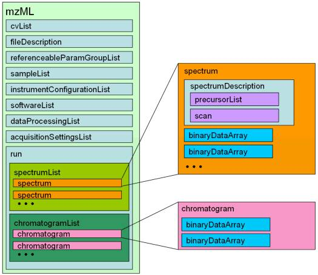
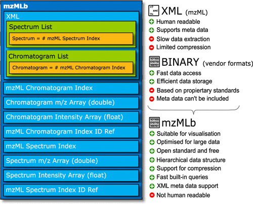

# OpenMS-playground
🎢 Playing with OpenMS functionalities

## Intro

This repo is created in preparation for the upcoming Google Summer of Code (GSoC) 2022.

## Goal

`OpenMS` is a framework for computational mass spectrometry. Modern mass spectrometers produce large files (e.g., 100 GB) that can’t be easily stored or accessed in the established `XML` file format `mzML`. Recently, an update to `mzML` has been developed that uses `HDF5` to store `Blosc` compressed spectra in binary format: called `mzMLb`.
In this project, the student will add a reader and writer for the `mzMLb` file format to `OpenMS`. To some extent, code from the `OpenMS` reader and writer for the `mzML` file format can be reused, as well as inspiration can be taken from reference implementations by other parties.

## mzML format and mzMLb format reference

### mzML file schema

### mzMLb internal data structure

## HDF5 + blosc

There's a well-wrapped [HDF5 plugin](https://github.com/Blosc/hdf5-blosc) for
HDF5 provided by the BLOSC team. It currently utilizes [BLOSC](https://github.com/Blosc/c-blosc).

We can install the provided plugin globally by copy the built dynamic lib to
`/path/to/hdf5/plugins` (e.g. `/usr/local/hdf5/lib/plugins` as in the documentation
 or `/usr/lib/x86_64-linux-gnu/hdf5/plugins` as on **Ubuntu 20.04 LTS**)

It's also possible to register the filter ad hoc using `register_blosc()` provided
in `blosc_filter.h`.

## Reference

1. [Mass Spectrometer Output File Format mzML](https://www.ncbi.nlm.nih.gov/pmc/articles/PMC3073315/)
2. [mzMLb: A Future-Proof Raw Mass Spectrometry Data Format Based on Standards-Compliant mzML and Optimized for Speed and Storage Requirements](https://pubs.acs.org/doi/10.1021/acs.jproteome.0c00192)
